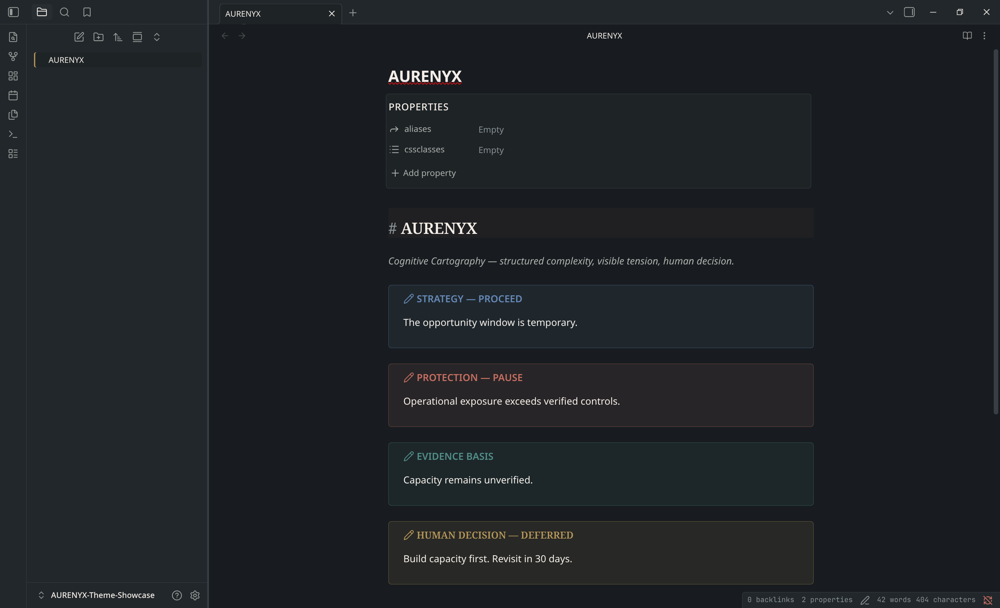
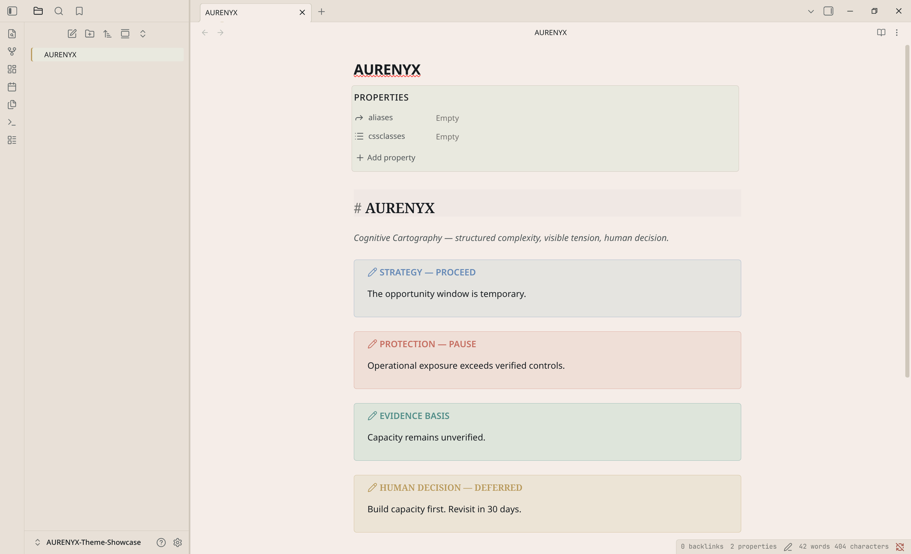

# AURENYX

**Cognitive Cartography for Obsidian.**

AURENYX is a restrained dark/light Obsidian theme built around structured complexity, visible tension, bounded technology, and explicit human agency.

## Preview

| Dark | Light |
| --- | --- |
|  |  |

## Design system

- **Obsidian** `#11161A` — primary dark field
- **Carbon** `#1B2227` — panels and structural depth
- **Ivory** `#F2EFE7` — primary text / archival light field
- **Brass** `#B99A58` — human action and focus
- **Teal** `#4F8F8A` — evidence, sources, empathy
- **Coral** `#C86F61` — conflict, exposure, protection
- **Blue** `#6689B7` — strategy and scenario information

Typography follows the AURENYX system:
- Noto Sans — UI and documentation
- Noto Serif — editorial depth and key statements
- Noto Mono — technical / evidence contexts

## Features

- Dark and light modes
- Editor and reading view
- Workspace, tabs, sidebars and navigation
- Properties / metadata
- Tables, code, tags and tasks
- Canvas and Graph
- Modals, settings and command palette
- Print styling and reduced-motion support
- AURENYX semantic callouts

## Semantic callouts

```md
> [!strategy]
> Strategic perspective or scenario information.

> [!protection]
> Exposure, controls, or protective perspective.

> [!empathy]
> Human impact, capacity, or empathy perspective.

> [!shadow]
> Hidden motive, blind spot, or shadow hypothesis.

> [!evidence]
> Source, observation, datum, or evidentiary basis.

> [!conflict]
> Explicit unresolved conflict or trade-off.

> [!synthesis]
> System synthesis or advisory interpretation.

> [!dissent]
> A view that remains unresolved after synthesis.

> [!human-decision]
> Final human decision or authorization.
```

## Installation

Once accepted into the Obsidian Community Theme directory:

**Settings → Appearance → Themes → Manage → AURENYX**

For manual installation, place `manifest.json` and `theme.css` in:

```text
<Vault>/.obsidian/themes/AURENYX/
```

## Philosophy

AURENYX is intended to behave like a cognitive instrument, not a decorative AI skin:

- structure before spectacle
- color reserved for meaning
- visible boundaries and tensions
- human action remains visually final
- no neon, cyberpunk glow, surveillance imagery, or decorative luxury-gold

## License

Theme source code is released under the MIT License.

The AURENYX name, logo, brand identity, and associated marks are not licensed for use as trademarks by this software license.
